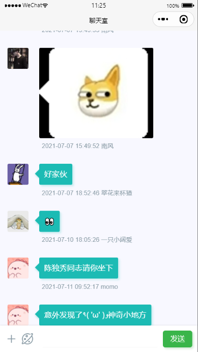

> 为了 `Azu`程序员同行身体健康，不气到同行，该项目自 `2021-10-13`起停止维护
>
> 本次更新：稍微修改了下命名


### 功能实现

- [x] 即时消息监听推送
- [x] 文本内容安全核验
- [x] 图片内容安全核验
- [x] 历史消息查询
- [x] 小黑屋功能：禁止用户发言
- [x] 消息位置锚定 `scroll-view`


### 效果预览




### 项目部署

1. 按照下方`数据表设计`新建数据集合，并设置所有数据表为访问权限为`所有用户可读，仅创建者可读写`。
2. 修改`config.js`配置文件中`CloudID`为你自己的云环境ID。
3. 上传并部署全部云函数
4. 进入云开发后台，配置上传云函数环境变量 `TZ` 为 `Asia/Shanghai`
5. `cloud-blcak-timer`需要上传触发器
6. 重新编译项目


### 数据表设计

> chat-users  聊天室用户信息表

| 字段     | 说明                     | 类型   |
| -------- | ------------------------ | ------ |
| _id      | 数据库记录唯一ID         | string |
| openid   | 用户唯一身份识别ID       | string |
| userInfo | 用户头像 昵称 地址等信息 | object |

> chat-users-ban 聊天室小黑屋信息表

| 字段        | 说明             | 类型   |
| ----------- | ---------------- | ------ |
| _id         | 数据库记录唯一ID | string |
| ban_date    | 禁言时长 单位天  | number |
| _createTime | 记录创建时间     | string |
| _updateTime | 记录更新时间     | string |

> chat-msgs 消息记录表

| 字段        | 说明                                             | 类型   |
| ----------- | ------------------------------------------------ | ------ |
| _id         | 数据库记录唯一ID                                 | string |
| roomId      | 会话房间号                                       | number |
| openid      | 消息发送者openid                                 | string |
| msgType     | 消息类型 目前有 text image                       | string |
| content     | 消息内容 text ：对应消息内容 image：对应图片地址 | string |
| userInfo    | 用户头像 昵称 地址等信息                         | object |
| _createTime | 消息创建时间                                     | string |

> chat-msgs-ban 非法消息记录表（内容/图片安全校验不通过）

| 字段        | 说明                                             | 类型   |
| ----------- | ------------------------------------------------ | ------ |
| _id         | 数据库记录唯一ID                                 | string |
| roomId      | 会话房间号                                       | number |
| openid      | 消息发送者openid                                 | string |
| msgType     | 消息类型 目前有 text image                       | string |
| content     | 消息内容 text ：对应消息内容 image：对应图片地址 | string |
| userInfo    | 用户头像 昵称 地址等信息                         | object |
| _createTime | 消息创建时间                                     | string |

### 拓展开发

项目提供的聊天室`Demo`为单聊天室模式，默认`roomId = 1`。为如果想要做成多用户聊天不同的形式，如`QQ`，只需要做如下几个步骤

1. 自定义数据集合，为不同用户之间聊天分配不同的 `roomId`

2. 引用组件时传入不同`roomId`即可

   ```html
   <chat-box roomId="{{roomId}}"></chat-box>
   ```

3. 调用消息发送云函数时，传入 `roomId`

> TIPS

建议复用`index/index.js`页面，只需跳转该页面时，携带`roomId`参数，并赋值给`data`中的`roomId`即可

```js
 onLoad: function (options){
	this.setData({
		roomId:options.roomId
	})
}
```


### 服务支持

提供有偿技术支持   kindear@foxmail.com

